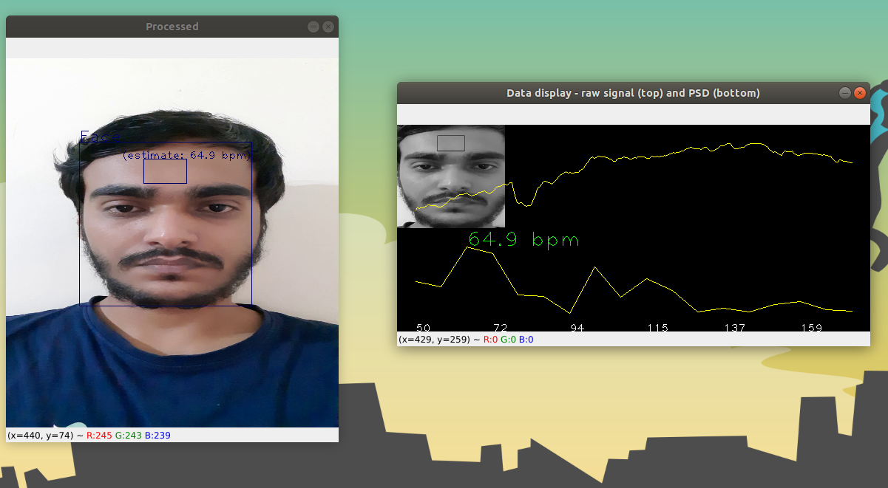

# Heart-rate-variation-detection-using-Computer-Vision-and-Signal-processing
This repository is created as a submission of task-1 while attending Computer Vision and Signal Processing intenrship at MetFlux Research.

## This repository is an example of using Computer Vision and Signal Processing using OpenCV-Python written in Python(3.6.9) 

Pulse-detector-using-Computer Vision
-----------------------





Requirements:
---------------

- [Python v3.5+](http://python.org/)
- [OpenCV v2+](http://opencv.org/)
- Numpy, Scipy
- [source_video.mp4](https://iitram-my.sharepoint.com/:v:/g/personal/kamlesh_kumar_19e_iitram_ac_in/EfCewkfkKyRBsN9ztFdHWb4BNBLCFl77cAO_naUxKHmNGA?e=75GPJE)
Quickstart:
------------

- run get_pulse_from_video.py to start the programme

```
python get_pulse_from_video.py
```

